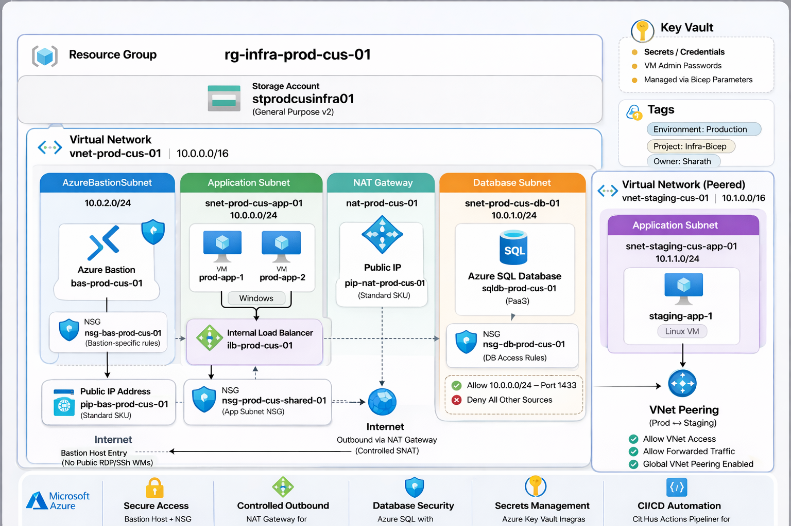

# ☁️ Azure Secure Multi-Tier Infrastructure using Bicep

> ⭐ This project simulates how real Azure infrastructure is built incrementally in production environments using Bicep.
>
> ⚠️ This project requires pre-configured dependencies (Key Vault, SAS token) before deployment. See the [Prerequisites](#-prerequisites) section.

Production-style Azure infrastructure deployed using Infrastructure as Code (Bicep), built step-by-step to reflect real-world environment evolution and validated through hands-on testing.

---

## 📌 Overview

This project demonstrates end-to-end Azure infrastructure deployment using a progressive lab approach, where each stage introduces a new component and builds on the previous one.

Instead of deploying a complete solution in a single step, the environment was developed incrementally to better understand dependencies, behavior, and real-world failure scenarios.

The final solution represents a secure, multi-tier architecture with controlled access, internal load balancing, cross-network connectivity, a relational database tier, outbound NAT, and consistent resource tagging.

---

## 🔑 Highlights

- 🌐 Azure Networking (VNet, Subnets, Peering)
- 🔒 Secure Access (Azure Bastion, NSG per tier)
- ⚖️ Load Balancing (Internal Load Balancer)
- 📤 Outbound Connectivity (NAT Gateway)
- 🗄️ Database Tier (Azure SQL Serverless)
- 🧱 Infrastructure as Code (Bicep — modular)
- 🔑 Key Vault Integration
- 🏷️ Resource Tagging

---

## 🖼️ Architecture Preview

<p align="center">
  
</p>

<p align="center">
  <i>Secure multi-tier Azure architecture with Bastion access, NAT Gateway, internal load balancing, SQL database tier, and VNet peering</i>
</p>

### 🔍 Key Characteristics

- Segmented virtual network (Application / Database / Bastion)
- No public IP exposure for virtual machines
- Secure administrative access via Azure Bastion
- Internal Load Balancer for web tier availability
- NAT Gateway restoring outbound internet for VMs behind Standard ILB
- Azure SQL Serverless restricted to App subnet via VNet rule
- Separate staging network connected via VNet peering
- Consistent tags on every resource for cost tracking and governance

---

## ⚙️ Solution Components

### 🌐 Networking

- **Virtual Network (Production):** `vnet-prod-cus-01`
- **Virtual Network (Staging):** `vnet-staging-cus-01`
- **Subnets:**
  - `snet-prod-cus-app-01` — Application tier
  - `snet-prod-cus-db-01` — Database tier
  - `AzureBastionSubnet` — Bastion host
- **VNet Peering:** bi-directional (prod ↔ staging)

### 💻 Compute

- 2 × Windows Server VMs (IIS configured via Custom Script Extension)
- 1 × Linux VM (staging network, used for connectivity validation)

### 🔒 Security

- **Azure Bastion:** `bas-prod-cus-01` (Standard SKU)
- **NSGs:**
  - `nsg-prod-cus-shared-01` — App subnet
  - `nsg-bas-prod-cus-01` — Bastion subnet
  - `nsg-db-prod-cus-01` — Database subnet (port 1433 from App subnet only)
- Public IP assigned only to Bastion and NAT Gateway — VMs have no public IPs

### ⚖️ Load Balancing

- **Internal Load Balancer:** `ilb-prod-cus-01` (Standard SKU)
- Backend pool: both Windows VMs
- Health probe: HTTP on port 80

### 📤 NAT Gateway

- **NAT Gateway:** `ng-prod-cus-01`
- **Public IP:** `pip-nat-prod-cus-01`
- Restores outbound internet for VMs behind the Standard ILB

### 🗄️ Database

- **Azure SQL Server:** `sql-prod-cus-db-01`
- **Database:** `sqldb-prod-cus-01` (Serverless — auto-pauses after 60 min)
- Access restricted to `snet-prod-cus-app-01` via VNet rule and service endpoint
- TLS 1.2 enforced, credentials stored in Key Vault

### 🗄️ Storage & Secrets

- **Storage Account:** `stprodcusinfra01` (script hosting)
- **Azure Key Vault** (external) for all credential management

---

## 🧱 Deployment Approach — Incremental Labs

| Lab | Component Introduced |
|-----|----------------------|
| 01 | Virtual Network |
| 02 | Storage Account |
| 03 | Network Security Group |
| 04 | NSG Subnet Attachment |
| 05 | Windows Virtual Machines |
| 06 | Azure Bastion |
| 07 | Custom Script Extension (IIS) |
| 08 | Internal Load Balancer |
| 09 | Linux Virtual Machine |
| 10 | VNet Peering |
| 11 | NAT Gateway |
| 12 | SQL Database + DB Subnet NSG |
| 13 | Resource Tagging |

This approach ensures:

- ✅ Independent validation at each stage
- ✅ Clear understanding of dependencies
- ✅ Easier troubleshooting when something goes wrong
- ✅ Deployable as individual labs or as a complete solution from Lab 13

---

## 🔐 Security Design

- No direct internet access to virtual machines
- All administrative access routed through Azure Bastion
- NSG rules restrict RDP exclusively to the Bastion subnet
- Database subnet NSG denies all traffic except port 1433 from the App subnet
- SQL Server access enforced via VNet service endpoint and VNet rule
- All secrets retrieved from Azure Key Vault — never stored in code or parameter files
- Network segmentation enforced at the subnet level with separate NSGs per tier

---

## ✅ Prerequisites

Before running any deployment, make sure the following are in place.

### 1. 📦 Resource Group

```powershell
New-AzResourceGroup -Name rg-infra-prod-cus-01 -Location "centralus"
```

### 2. 🔑 Azure Key Vault

The deployment pulls VM and SQL credentials directly from Key Vault at deploy time. Ensure the vault exists, the secrets are populated, and the deploying identity has the `Key Vault Secrets User` role.

Required secrets:
- `win-app-admin-password`
- `linux-app-admin-password`
- `sql-admin-password` *(required from Lab 12 onwards)*

### 3. 🔗 Valid SAS Token

The Custom Script Extension (Lab 07) downloads `setup-iis.ps1` from a Storage Account using a SAS token. Check the `se=` expiry date in `parameters/dev.parameters.json` before deploying — an expired token will cause the extension to fail silently while the deployment reports success.

### 4. 🛠️ Required Tools

- Azure PowerShell (Az module) or Azure CLI
- Bicep CLI

---

## 🚀 Deployment

Each lab is self-contained. Navigate into the lab folder and run:

```powershell
New-AzResourceGroupDeployment `
  -ResourceGroup rg-infra-prod-cus-01 `
  -TemplateFile .\main.bicep `
  -TemplateParameterFile .\parameters\dev.parameters.json
```

To deploy the complete final solution, use Lab 13.

---

## 🖼️ Deployment Validation

All components were deployed and verified in a live Azure environment. Screenshots are maintained inside `docs/screenshots` folder and cover:

- Resource deployment confirmation (portal + PowerShell output)
- Bastion connectivity proof
- IIS availability via Bastion
- Load balancer health probe states
- VNet peering connectivity test (curl from staging VM)
- NAT Gateway outbound IP verification
- SQL connectivity from Windows VM ✅ and block from Linux VM ❌

---

## 📄 Documentation

| Document | Description |
|----------|-------------|
| [Architecture](docs/architecture.md) | Network topology, module dependency chain, design decisions |
| [Security](docs/security.md) | NSG rules, Key Vault integration, SQL access control |
| [Troubleshooting](docs/troubleshooting.md) | Real issues encountered and how they were resolved |

---

## 📊 What I Learned

### 🧱 Infrastructure as Code (Bicep)

- Writing modular and reusable Bicep templates with consistent parameter patterns
- Managing deployment order through implicit output references and `dependsOn`
- Understanding how incremental deployment mode handles resource removal

### 🌐 Azure Networking

- Designing multi-tier architecture with VNets, subnets, and NSG per tier
- Implementing secure cross-network connectivity using VNet Peering
- Understanding how Standard ILB affects outbound connectivity and how NAT Gateway solves it
- Configuring VNet service endpoints to restrict PaaS service access

### 🔐 Security Design

- Implementing zero-trust access using Azure Bastion (no VM public IPs)
- Designing NSG rules with least-privilege per subnet tier
- Managing all credentials through Key Vault references — never in plain text
- Understanding the difference between service endpoints and private endpoints

### 🛠️ Troubleshooting

- Diagnosing Custom Script Extension failures where ARM reports success but the script never ran
- Understanding why Azure SQL's gateway always accepts TCP connections regardless of firewall rules
- Resolving Bicep incremental mode leaving orphaned resources after template changes
- Working through SQL global naming conflicts and VNet rule configuration edge cases

---

## 🎯 Outcome

This project demonstrates:

- ✅ Practical experience with Azure networking, compute, and PaaS services
- ✅ Production-style Infrastructure as Code using modular Bicep
- ✅ Ability to design, deploy, and validate a three-tier architecture
- ✅ Hands-on troubleshooting of real deployment failures

---

## 👨‍💻 Author

**Sharath Kumar**
